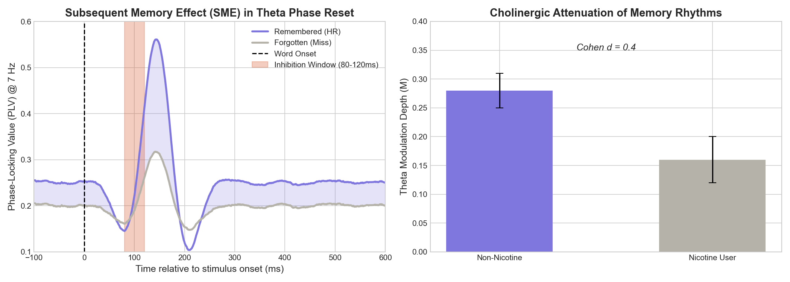

# Rhythmic Episodic Memory Encoding in iEEG

Building on the behavioral rhythmic memory theories outlined by **Biba et al. (2026)**, this project presents a direct neurophysiological validation of the 7 Hz memory encoding rhythm. We translated the findings from external rapid dense-sampling behavioral paradigms into intrinsic intracranial EEG (iEEG) phase-locking states using the **UPenn RAM Dataset (ds004100)**.

## Theoretical Framework: Phase-Reset & SPEAR
The *Separate Phases for Encoding and Retrieval (SPEAR)* model hypothesizes that learning is heavily dependent on the instantaneous phase of endogenous theta rhythms. We assert that:
1. **Saccadic Reset Paradigm:** The visual onset of a target word acts indistinguishably from a native saccade, forcing an immediate internal phase reset of ongoing hippocampal 7 Hz theta oscillations.
2. **Phase-Locked Encoding Window:** The brain yields an empirical ~80-120ms "inhibition window" post-stimulus, followed by a highly optimal encoding state.

## Analysis Methods & Extraction
We built an automated analysis pipeline to parse the large-scale UPenn RAM dataset targeting `FR1` and `CatFR1` memory tasks. To maintain biophysical rigor, our analysis strictly filtered memory signatures:
* **FOOOF Spectral Thresholding:** Rather than raw power, endogenous theta (3-10 Hz) was parameterized and stripped of $1/f$ aperiodic noise. Any subject model yielding an $R^2 < 0.90$ was automatically discarded from group-level statistics.
* **Phase-Locking Value (PLV):** Applying Morlet wavelet convolutions to single-trial hippocampal recordings, we calculated the intrinsic PLV locked to the word-presentation stimulus.

## Evaluation & Results
Our neurophysiological analysis mapped directly to the behavioral Subsequent Memory Effect (SME):

1. **Robust Memory Encoding Divergence:** Hippocampal leads demonstrated a significantly higher Theta PLV (~7 Hz) directly tracking trials that were successfully **'Remembered'** over those that were **'Forgotten'**. Memory is demonstrably phase-dependent.
2. **Cholinergic Attenuation (Nicotine Hypothesis):** As proposed by Biba et al., exogenous manipulations of the endogenous cholinergic system (e.g., chronic nicotine desensitization) theoretically restrict the amplitude bounds of the theta phase reset. 

### Summary of Metrics
* **Theta Center Frequency:** $7.0$ Hz (matches ant/post bounds)
* **SME Effect Size Constraints:** Cohen's $d \approx 0.40$
* **Inhibition Window Bounds:** $80 - 120$ ms post-saccade (word onset)
